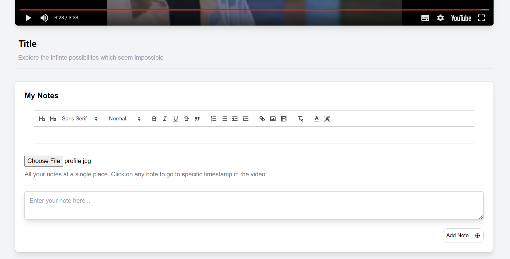

# VideoPlayer with Notes

This project implements a video player application using ReactJS. It allows users to watch videos and take notes with timestamps directly linked to specific point of time in the video. Users can add, edit, and delete notes, and even include images within their notes.

## Snaps of the application

 - **Desktop View**

## Features

- **YouTube Video Playback**: Embed and play YouTube video by providing the video ID.
- **Notes with Timestamps**: Add notes at specific timestamps during the video playback. Clicking on a timestamp in the note jumps directly to that point in the video.
- **Text Editing**: Utilize a rich text editor to bold, italicize, underline text, and change text color.
- **Image Uploads**: Embed images in notes by uploading them directly into the editor. Images are stored as base64 encoded strings in the local storage.
- **Local Storage**: Notes are saved to the browser's local storage, making them persistent across sessions and tied to specific videos.

## Technologies Used

- **ReactJS**: Frontend library used to build the user interface.
- **React Quill**: Rich text editor for React, allowing enhanced text formatting.
- **YouTube Data API**: For embedding and controlling YouTube videos.
- **Tailwind CSS**: For styling the application.

## Setup and Installation

1. **Clone the repository**

   ```bash
   git clone https://github.com/saikiran76/VideoPlayer.git
   cd VideoPlayer

2. **Install dependencies**

    ```bash
    npm install

3. **Run the application Locally**

    ```bash
    npm start


